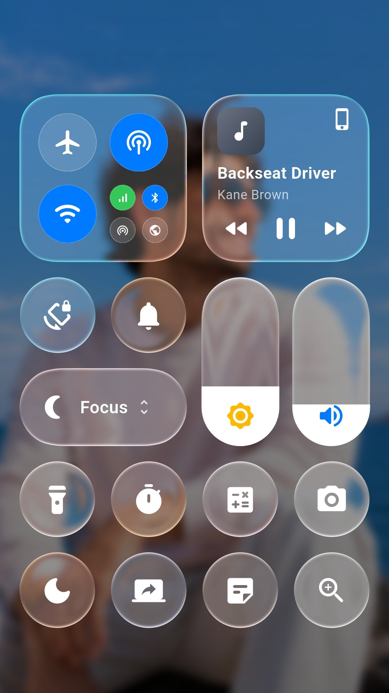
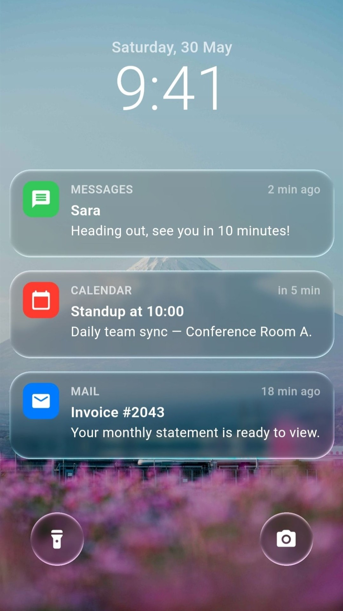

# Liquid Glass Easy

<p align="center">
  <a href="https://pub.dev/packages/liquid_glass_easy"></a>
  <a href="https://pub.dev/packages/liquid_glass_easy/score"></a>
  <a href="https://pub.dev/packages/liquid_glass_easy/score"></a>
  <a href="https://github.com/AhmeedGamil/liquid_glass_easy/blob/main/LICENSE"></a>
</p>

**A Flutter package that brings Apple's iOS-style Liquid Glass to your app with real-time, interactive lenses.**
These dynamic lenses **magnify**, **distort**, **blur**, **tint**, and **refract** the content behind them — recreating the iOS 26 Liquid Glass look with stunning, glass-like effects that respond fluidly to **movement** and **touch**.

<p>
  
  
</p>

<p>
  
  
</p>

<p>
  
  
</p>

<p>
  
</p>

---

## Building Blocks

| Block | API | What it does |
|---|---|---|
| **Glass** | `LiquidGlassLens` | The surface itself. Layout-driven — drop it anywhere and it refracts what's behind it. Styled with `LiquidGlassStyle`: shape, appearance, refraction. |
| **Touch** | `LiquidGlassTouch` | How glass answers a finger. Carries `LiquidGlassFlex`: press and it swells, drag and it deforms, release and it springs back. |
| **Motion** | `LiquidGlassLensMotionSpec` | Acceleration-driven deformation for moving glass — it stretches as it launches, squashes as it brakes, and rides undeformed at constant speed. The physics behind the slider thumb and the tab bar's pill (`motion:` on both). |
| **Blend** | `LiquidGlassBlender` | Merges 2–6 lenses into one surface, joined by a smooth metaball bridge. |
| **View** | `LiquidGlassView` | The Skia / web background pipeline. Not needed on Impeller. |
| **Components** | `LiquidGlassSlider`, `LiquidGlassSwitch`, `LiquidGlassButton`, `LiquidGlassFab`, `LiquidGlassAppBar`, `LiquidGlassTabBar`, `LiquidGlassAlertDialog`, `LiquidGlassScaffold`, `LiquidGlassDraggable` | Ready-made controls, each a lens with the blocks above already wired. |

---

### Render paths — Impeller, Skia, and the fallback

`LiquidGlassLens` resolves the best path for the engine your app is running on.
The widget tree you write is **identical** in every case:

| Engine / setup | Behavior |
|----------------|----------|
| **Impeller** (Flutter's default on modern iOS/Android) | The lens refracts the **live backdrop** — whatever your app painted behind it. **No `LiquidGlassView` and no background widget needed at all.** Just drop the lens over any UI. |
| **Skia** with an ancestor `LiquidGlassView` (+ `backgroundWidget`) | The lens refracts the view's **captured background**, wherever it sits inside the view's `child`. |
| **Skia** without a view | Refraction isn't possible, so the lens gracefully degrades to a **frosted** look (backdrop blur + tint + border) and logs a one-time debug notice. |

> In short: **on Impeller it just works anywhere**; on Skia you wrap your
> content in a `LiquidGlassView` to give the lens a background to refract.

---

### Touch — glass that answers a finger

Pass a `touch:` and the lens becomes a **soft body**. Press it and it swells
under your finger; drag it and it elongates along the pull, pinches in the
cross axis, leans after your thumb, then springs back with a wobble. The lens
never *moves* — only its shape and its content deform.

<p>
  
</p>

```dart
LiquidGlassLens(
  touch: const LiquidGlassTouch(
    flex: LiquidGlassFlex(),
  ),
  style: const LiquidGlassStyle(
    shape: LiquidGlassShape.continuousRoundedRectangle(cornerRadius: 26),
  ),
  child: myContent,
)
```

`touch` is a **group**, not a single effect: it carries the whole response a
surface has to a finger, so a control's feel travels as one value the way its
whole look travels as a `LiquidGlassStyle`. Today it holds `flex` — the
deformation — and further members land as new fields, not as a new parameter
on every component.

The four edges spring **independently**, so the half nearest your finger
deforms more than the far half — the asymmetry a scale transform cannot
produce. `grip` controls how localized that is (`0` = symmetric wherever you
touch, `1` = fully local), `squeeze` takes the along-axis gain back out of the
cross axis so an elongated lens genuinely gets thinner, and `lean` slides the
body after the finger. `.subtle()`, `.uniform()` and `.pronounced()` are tuned
starting points.

`null` — the default — adds **nothing** to the tree: no gesture listener, no
ticker, no cost.

---

### Blend — fuse lenses into one liquid surface

Wrap two to six `LiquidGlassLens` descendants in a `LiquidGlassBlender` and their
silhouettes merge into a single liquid glass surface: as neighbouring lenses
approach they grow a smooth **metaball bridge**, and they pull apart as you
separate them — each member keeps its own corner style through the merge.

```dart
LiquidGlassView(
  backgroundWidget: myBackground,
  child: LiquidGlassBlender(
    smoothness: 56,
    style: const LiquidGlassStyle(
      shape: LiquidGlassShape.continuousRoundedRectangle(cornerRadius: 36),
    ),
    child: Stack(
      children: const [
        Positioned(left: 40, top: 80, child: SizedBox(width: 120, height: 120, child: LiquidGlassLens())),
        Positioned(left: 120, top: 110, child: SizedBox(width: 100, height: 100, child: LiquidGlassLens())),
      ],
    ),
  ),
)
```

It works on **both backends** — Impeller samples the live backdrop, Skia refracts
the captured background (place it inside a `LiquidGlassView`).

> ⚠️ **A note on blur on Skia.** In-shader blur on the Skia capture path may cost
> **performance** when the lenses are big or the blur is big. Also, **high blur
> (above ~7)** doesn't match the look of a real backdrop blur. It isn't clamped,
> though — the value is left unrestricted so you can push it if you want; just
> expect it to diverge from the Impeller look at high sigmas.

---

### What each component needs

On **Impeller** every component refracts the live backdrop and works **anywhere**
with no setup. The difference shows on **Skia**: some refract the *app* content
behind them (so they need an ancestor `LiquidGlassView`), while others supply
their own background and work anywhere on both engines.

| Component | Skia requirement |
|---|---|
| `LiquidGlassSlider` | **None** — self-contained, it owns its background. Works anywhere on both engines. |
| `LiquidGlassSwitch` | **None** — refracts its own track. Works anywhere on both engines. |
| `LiquidGlassScaffold` | **None** — it *is* the pipeline; its child lenses refract the body on both engines. |
| `LiquidGlassButton` | Needs an ancestor `LiquidGlassView` (frosted fallback without one). |
| `LiquidGlassAppBar` | Needs an ancestor `LiquidGlassView`. |
| `LiquidGlassFab` | Needs an ancestor `LiquidGlassView`. |
| `LiquidGlassAlertDialog` | Open it from a context inside a `LiquidGlassView`. |
| `LiquidGlassTabBar` | Use it inside a `LiquidGlassScaffold`, which provides the view. For **anywhere on Impeller**, use `LiquidGlassTabBar.withImpeller(...)`. |
| `LiquidGlassDraggable` | Inherits whatever the lens it wraps requires. |

> **Migration note:** the old position-driven lens API (`LiquidGlass`) is
> **no longer used** — it has been replaced by `LiquidGlassLens`. Write new code
> against `LiquidGlassLens` and the drop-in components.
>
> Per-release history lives in [CHANGELOG.md](CHANGELOG.md).

---

## Why Liquid Glass Easy?

Unlike traditional glassmorphism or static blur, **Liquid Glass Easy** simulates
*real glass physics* — complete with **refraction, distortion, and fluid
responsiveness**. It bends live content behind the glass in real time,
producing **immersive, motion-reactive visuals** that bring depth and realism
to your UI.

---

## Features

The systems above are *what* you build with. These are the qualities they all
share:

- **True liquid glass visuals** — real-glass look and physics with fluid transparency, soft highlights, and light-bending refraction.
- **Real-time rendering** — distortion, blur, tint, and refraction react instantly as content moves behind the glass.
- **Custom shapes** — circular rounded rectangles, iOS-style squircles, or Apple-style continuous-corner capsules.
- **Two border modes** — stylized `ClassicBorder` or background-tinted `OpticalBorder`.
- **Shader-driven, GPU-accelerated** — smooth, high-FPS performance.
- **Cross-platform** — Android, iOS, Web, macOS, and Windows.

---

## Installation

```yaml
dependencies:
  liquid_glass_easy: ^4.1.1
```

```bash
flutter pub get
```

---

## Getting Started

### 1. The simplest case — a lens, anywhere (Impeller)

On Impeller you don't need a `LiquidGlassView` or a background. Just drop a
`LiquidGlassLens` over your UI:

```dart
import 'package:flutter/material.dart';
import 'package:liquid_glass_easy/liquid_glass_easy.dart';

class DemoGlass extends StatelessWidget {
  const DemoGlass({super.key});

  @override
  Widget build(BuildContext context) {
    return Scaffold(
      body: Stack(
        fit: StackFit.expand,
        children: [
          Image.asset('assets/bg.jpg', fit: BoxFit.cover),
          Center(
            child: SizedBox(
              width: 260,
              height: 150,
              child: LiquidGlassLens(
                style: const LiquidGlassStyle(
                  shape: LiquidGlassShape.squircle(cornerRadius: 44),
                  refraction: LiquidGlassRefraction(
                    distortion: 0.13,
                    distortionWidth: 34,
                  ),
                ),
                child: const Center(child: Text('Liquid Glass')),
              ),
            ),
          ),
        ],
      ),
    );
  }
}
```

### 2. The Skia path — wrap in a `LiquidGlassView`

To make refraction work on Skia, give the lens a background to
refract by placing it inside a `LiquidGlassView.child`:

```dart
LiquidGlassView(
  backgroundWidget: const MyBackground(), // required on Skia
  child: Center(
    child: SizedBox(
      width: 300,
      height: 160,
      child: LiquidGlassLens(
        style: const LiquidGlassStyle(
          shape: LiquidGlassShape.squircle(cornerRadius: 40),
          refraction: LiquidGlassRefraction(distortion: 0.12, distortionWidth: 30),
        ),
        child: const Center(child: Text('refracts the captured background')),
      ),
    ),
  ),
)
```

The exact same `LiquidGlassLens` code refracts the live backdrop on Impeller and
the captured `backgroundWidget` on Skia — no changes required.

### Explore interactively

You can find the demos shown above under the [`example/`](example/) folder.

---

## Core API

### `LiquidGlassLens`

```dart
LiquidGlassLens({
  LiquidGlassStyle style = const LiquidGlassStyle(),
  bool visibility = true,        // instant show/hide; hidden = no backdrop cost
  bool? useImpellerBackdrop,     // override engine auto-detection
  Widget? child,                 // clipped to the lens shape
})
```

Size comes from layout — wrap it in a `SizedBox` (or let its child/constraints
size it). The `child` is always clipped to the full lens shape; add your own
`Padding` to inset it.

### `LiquidGlassStyle`

```dart
LiquidGlassStyle({
  LiquidGlassShape? shape,                // null → default continuous rounded rect
  LiquidGlassAppearance appearance = const LiquidGlassAppearance(),
  LiquidGlassRefraction refraction = const LiquidGlassRefraction(),
})
```

`copyWith(...)` and `merge(other)` are provided for theme/override patterns.

#### `LiquidGlassRefraction`

| Property | Default | Description |
|----------|---------|-------------|
| `distortion` | `0.1` | Bending strength of the distortion (`0.0`–`1.0`). |
| `distortionWidth` | `30` | Thickness of the distortion band around the perimeter, in px. |
| `magnification` | `1.0` | Magnification of content seen through the lens (`1.0` = none). |
| `chromaticAberration` | `0.003` | Color-channel separation; `0.0` disables it. |
| `refractionMode` | `shapeRefraction` | `shapeRefraction` (follows shape contours) or `radialRefraction` (circular pattern). |

#### `LiquidGlassAppearance`

| Property | Default | Description |
|----------|---------|-------------|
| `color` | `transparent` | Base tint of the lens (often semi-transparent). |
| `blur` | `LiquidGlassBlur()` | Blur applied to content beneath the glass. |
| `saturation` | `1.0` | `1.0` = unchanged, `0.0` = grayscale. |
| `enableInnerRadiusTransparent` | `false` | Whether the inner, non-distorted region is transparent. |
| `shadow` | `null` | Contact shadow (`LiquidGlassShadow`) the lens wraps itself in — part of the material, so it travels wherever the style goes. Components take their shadow from here, never as a separate parameter. |

#### `LiquidGlassShape`

Pick a corner curve via a convenience constructor:

| Constructor | Corner style |
|-------------|--------------|
| `LiquidGlassShape.roundedRectangle(...)` | Plain **circular** corners (cheapest). |
| `LiquidGlassShape.squircle(...)` | **L^n squircle** — iOS-style continuous curvature. |
| `LiquidGlassShape.continuousRoundedRectangle(...)` | **Apple capsule-style** continuous corners (**default**; collapses to a clean capsule at full radius). |

Common parameters: `cornerRadius`, `borderWidth`, `borderColor`, `lightColor`,
`lightIntensity`, `lightDirection`, `borderType`, and `clipQuality`
(`roundedRectangle` = cheap circular clip, `exact` = shape-matched `ClipPath`).

> **Tip — choosing `clipQuality`:**
> - **`squircle`:** it's worth using `LiquidGlassClipQuality.exact`. The squircle
>   has its own shader-matched `ClipPath`, so `exact` makes the clipped child/blur
>   silhouette follow the true L^n curve instead of a plain rounded rectangle.
> - **`continuousRoundedRectangle`:** leave `clipQuality` at its default
>   (`roundedRectangle`). A rounded-rectangle clip already hugs the continuous
>   corner so closely that there's effectively **no visible difference** from the
>   `exact` continuous clipper — that continuous clipper is only there as an
>   experiment, and `exact` just adds an extra (more expensive) save layer for no
>   real gain. Only reach for `exact` here if you can actually *see* the clipped
>   edge not lining up with the refraction.

### `LiquidGlassView` (Skia background provider)

```dart
LiquidGlassView({
  required Widget backgroundWidget,  // refracted by lenses on Skia
  Widget? child,                     // your UI, containing LiquidGlassLens widgets
  double pixelRatio = 1.0,
  bool realTimeCapture = true,
  bool useSync = true,
  bool? useImpellerBackdrop,
  LiquidGlassRefreshRate refreshRate = LiquidGlassRefreshRate.deviceRefreshRate,
})
```

---

## Border Modes

Every shape renders its border in one of two styles through `borderType`.

| Mode | Description |
|------|-------------|
| `ClassicBorder` | Light/shadow colors sweep around the shape based on the angle between the surface normal and the light direction. Clean, stylized, direct color control. |
| `OpticalBorder` | **(default)** An Apple-style, SDF-based rim light that emerges as an optical consequence of the glass shape — background-tinted highlights, dual-sided specular reflections, and a lens height profile. The rim color adapts to whatever sits behind the lens. |

### Optical Border

```dart
LiquidGlassLens(
  style: const LiquidGlassStyle(
    shape: LiquidGlassShape.squircle(
      cornerRadius: 36,
      borderType: OpticalBorder(
        borderSaturation: 1.5,
        ambientIntensity: 1.0,
        borderSolidity: 0.0,
      ),
    ),
  ),
)
```

| Property | Description |
|----------|-------------|
| `borderSaturation` | Saturation of the border color. `0.0` grayscale, `1.0` unchanged (default), `>1.0` more vivid. Range `0.0`–`3.0`. |
| `ambientIntensity` | Ambient rim contribution, keeping it visible on the shadow side. `1.0` default. Range `0.0`–`5.0`. |
| `borderSolidity` | How far `lightIntensity` can push the rim toward opaque. `0.0` translucent (default) → `1.0` solid. |

### Classic Border

```dart
LiquidGlassLens(
  style: const LiquidGlassStyle(
    shape: LiquidGlassShape.roundedRectangle(
      lightColor: Color(0xB2FFFFFF),
      borderType: ClassicBorder(
        borderSoftness: 2.5,
        shadowColor: Color(0x1A000000),
      ),
    ),
  ),
)
```

| Property | Description |
|----------|-------------|
| `borderSoftness` | Feathered edge transition. Higher = softer. Defaults to `1.0`. |
| `shadowColor` | Shadow color on the opposite side of the border for depth. Defaults to `Color(0x1A000000)`. |

---

## Common Patterns

### Draggable lens

```dart
LiquidGlassDraggable(
  child: SizedBox(
    width: 200,
    height: 200,
    child: LiquidGlassLens(
      style: const LiquidGlassStyle(
        shape: LiquidGlassShape.roundedRectangle(cornerRadius: 100),
        refraction: LiquidGlassRefraction(distortion: 0.2, magnification: 1.1),
      ),
      child: const Center(child: Text('drag me')),
    ),
  ),
)
```

### Show / hide

`visibility: false` disables the glass instantly (no backdrop cost) and removes
the child, leaving nothing behind. Wrap the lens yourself to animate the
transition:

```dart
LiquidGlassLens(visibility: _visible, style: myStyle, child: content)
```

### Lenses inside scrollables

> **Not recommended.** Liquid glass is designed to **float above** your content
> — a fixed lens (a bottom bar, a floating panel, a control overlay) that
> refracts the scrolling content passing *behind* it. Putting the lens *inside*
> the scrollable, so it scrolls with the list, fights that concept and runs into
> the overscroll issue below. Prefer a floating lens layered over the list (e.g.
> in a `Stack`) instead of a lens placed as a list item.
>
> If you do need a lens inside a scrollable in Impeller, you **must** disable the
> overscroll indicator — see below.

### Using Lenses inside scrollables (Impeller)

Android's stretch overscroll isolates the scrollable into its own layer, which
can make backdrop lenses render **black** at the scroll edges. Disable the
overscroll indicator for scrollables that contain lenses:

```dart
ScrollConfiguration(
  behavior: const MaterialScrollBehavior().copyWith(overscroll: false),
  child: ListView(children: [ /* ...LiquidGlassLens... */ ]),
)
```

---

## Drop-in Components

```dart
// A glass slider — the thumb lifts into clear glass under your finger
// and deforms from acceleration as it travels.
LiquidGlassSlider(
  value: volume,
  onChanged: (v) => setState(() => volume = v),
  width: 320,
);

// A glass switch.
LiquidGlassSwitch(
  value: wifi,
  activeColor: const Color(0xFF0A84FF),
  onChanged: (v) => setState(() => wifi = v),
  width: 63,
  height: 28,
);
```

Both size themselves, so a `SizedBox` around one does nothing — give
them `width` / `height` instead. Those two are a shorthand for the same
fields on `layout`, which is where the rest of the geometry lives (the
thumb's resting and lifted sizes, the track thickness, the end icons).

Both also ship the tuned look out of the box, exposed as
`LiquidGlassSlider.defaultStyle` / `LiquidGlassSwitch.defaultStyle`: a
**clear** thumb — refraction and a soft rim, no tint — with a tucked-in
contact shadow riding `defaultStyle.appearance.shadow`. Change one facet
without retyping the rest
(`style: LiquidGlassSlider.defaultStyle.copyWith(refraction: …)`), or
hand over an appearance carrying no shadow to drop the shadow.

Each component is self-contained and styled through the same
`LiquidGlassStyle` vocabulary. Other components: `LiquidGlassButton`,
`LiquidGlassFab`, `LiquidGlassAppBar`, `LiquidGlassTabBar`,
`LiquidGlassAlertDialog`, `LiquidGlassScaffold`.

### Tab bar — the moving glass pill

`LiquidGlassTabBar`'s selection pill is real glass on **every renderer**
by default: it lifts off the tab the moment you tap, travels on a spring
— stretching as it launches, squashing as it brakes — and refracts the
bar's own capsule as it passes. A settled bar costs no shader pass at
all. The tier is chosen by `LiquidGlassTabPillStyle.mode` (`both` /
`impellerOnly` / `none`), and the pill's look, motion and contact shadow
are tuned defaults — the shadow authored, like every lens's, on its glass
style's `appearance.shadow` (the bar capsule's likewise on the bar
`style`'s appearance).

The tab **under** the pill is its own state: `underGlassIconSize` and
`underGlassLabelFontSize` on `LiquidGlassTabItemStyle` let the icon and
label render bigger while the glass is over them. The enlargement is the
glass's effect, not the selection's — it rides under the pill for the
whole travel and glides back down through the landing.

### Custom icons & labels — SVG, PNG, rich text, anything

Tabs aren't limited to `IconData`. Give `LiquidGlassTabBarItem` an
`iconBuilder` instead of an `icon` and the glyph is drawn through your
builder, so any widget works — an `SvgPicture`, an `Image`, a
`CustomPaint`:

```dart
LiquidGlassTabBarItem(
  label: 'Home',
  iconBuilder: (context, i) => SvgPicture.asset(
    i.selected ? 'assets/home_fill.svg' : 'assets/home.svg',
    width: i.size,
    height: i.size,
    colorFilter: ColorFilter.mode(i.color, BlendMode.srcIn),
  ),
);
```

The builder is handed the color the bar already resolved for the layer it
is drawing, the glyph box size, and whether that layer is the selected
one. Tint with `i.color` and your artwork follows the selected /
unselected palette **and** the morph pill's reveal — the glass-pill bar
draws each tab twice per frame, once inside the pill and once outside it,
and calls the builder for each. Multi-colour art can simply ignore the
colour. `LiquidGlassButton` and `LiquidGlassTabBarAction` take a `child`
for the same reason.

Labels have the same escape hatch: `labelBuilder` draws the label line
instead of the plain `Text` — a custom font, rich text, a badge row. It
receives the already-resolved `textStyle` (color, size, weight) for the
layer being drawn, so `copyWith` keeps the stock look and changes only
what you need — and like `iconBuilder` it runs once per rendered layer,
so a custom label follows the pill's reveal too:

```dart
LiquidGlassTabBarItem(
  icon: Icons.inbox_rounded,
  label: 'Inbox',
  labelBuilder: (context, l) => Row(
    mainAxisSize: MainAxisSize.min,
    children: [
      Text(l.text!, style: l.textStyle),
      const SizedBox(width: 3),
      Container(
        width: 6,
        height: 6,
        decoration: const BoxDecoration(
          color: Colors.red,
          shape: BoxShape.circle,
        ),
      ),
    ],
  ),
);
```

### Tab bar — standalone with `.withImpeller`

`LiquidGlassTabBar` shows its animated, glass-refracting **morph
selection pill** when it's driven by a `LiquidGlassScaffold`, which owns the
capture pipeline and hands the bar the page as its background.

To use the bar **on its own** — no `LiquidGlassScaffold` and no `body` to pass
— use the **`.withImpeller`** constructor. On Impeller the bar and its morph
pill sample the live backdrop, so just drop it as the last child of a `Stack`
over your page:

```dart
Stack(
  children: [
    MyPage(),
    LiquidGlassTabBar.withImpeller(
      items: items,
      selectedIndex: index,
      onChanged: (i) => setState(() => index = i),
    ),
  ],
);
```

> `.withImpeller` is **Impeller-first**: on Skia (no live-backdrop
> shader) it falls back to a plain frosted bar that still shows the content
> behind it. For the refracting morph pill on Skia, use a
> `LiquidGlassScaffold` with a real `body`.

---

## Snapshot vs Realtime (Skia capture)

When you use a `LiquidGlassView` on Skia, choose how its background is
captured:

| Mode | When to Use | Config |
|------|-------------|--------|
| **Realtime** | Moving backgrounds (scrolling, video) | `realTimeCapture: true` |
| **Snapshot** | Static backgrounds | `realTimeCapture: false` + `viewController.captureOnce()` |

```dart
final viewController = LiquidGlassViewController();

LiquidGlassView(
  controller: viewController,
  backgroundWidget: const MyBackground(),
  realTimeCapture: false,
  child: const MyGlassUI(),
);

// Refresh manually after the background changes:
await viewController.captureOnce();
```

> On **Impeller** the lens reads the live backdrop directly, so capture settings
> don't apply — these are a Skia concern.

---

## Recommended Settings (Skia capture)

- **General use:** `useSync: true`, `pixelRatio: 0.8–1.0`
- **Performance-focused:** `useSync: false`, `pixelRatio: 0.5–0.7`

> For full-screen backgrounds, `pixelRatio` of 0.5–1.0 balances performance and
> detail. Smaller regions can afford higher ratios for sharper glass. The final
> choice depends on the device.

---

## License

**MIT License**

---

## Developed by

**Ahmed Gamil**

Feel free to open issues or contribute to the project!
